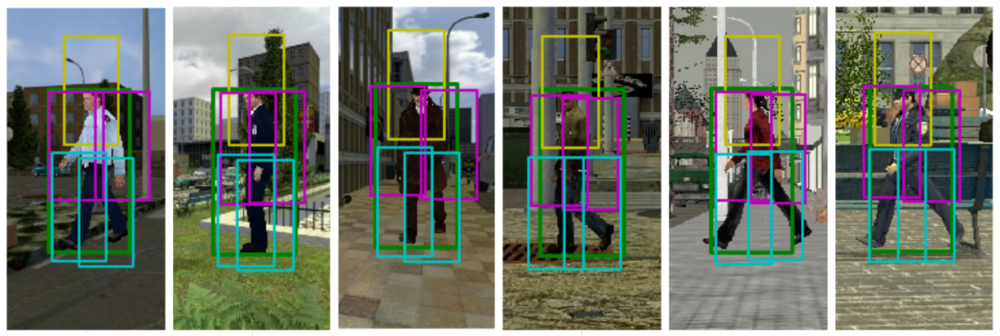

CVC-07: Virtual-World Dataset 
================================

## Summary
- This dataset contains 2534 pedestrian images and 2000 background images. The pedestrian images have frontal view and left view, which are annotated as 'M' and 'L'. You may flip the pedestrians to get right view examples.
- An illustration of the dataset can be found [here](http://nbviewer.ipython.org/gist/Jiaolong/9959174)
- For downloading the data, please visit [our websiet](http://www.cvc.uab.es/adas/site/?q=node/7). Previous version of virtual-world dataset and other datasets of ADAS group can be also found there.  
- Please consider citing our paper if you use virtual-world dataset in your research:
    
      @article{xu:2014,
      title={Learning a Part-based Pedestrian Detector in Virtual World},
      author={J. Xu, D. Vazquez, A. M. Lopez, J. Marin, D. Ponsa},
      journal={IEEE Transactions on Intelligent Transportation Systems},
      year={2014}}

## Annotations
- The annotations are saved in: annotation.mat
- The struct is as follows:
	- filename
	- boxes
	- view
	- parts
	- pLocations
- The root bounding box is saved in `bboxes`. The format is [x1 y1 x2 y2].
- Part bounding boxes are in `parts`.
- `pLocations` record the part center points.
- Clustered view information:
	- Left view: `L`
	- Frontal/rear view: `M`

## Contact
- jiaolong@cvc.uab.es
- Website: www.cvc.uab.es/adas
